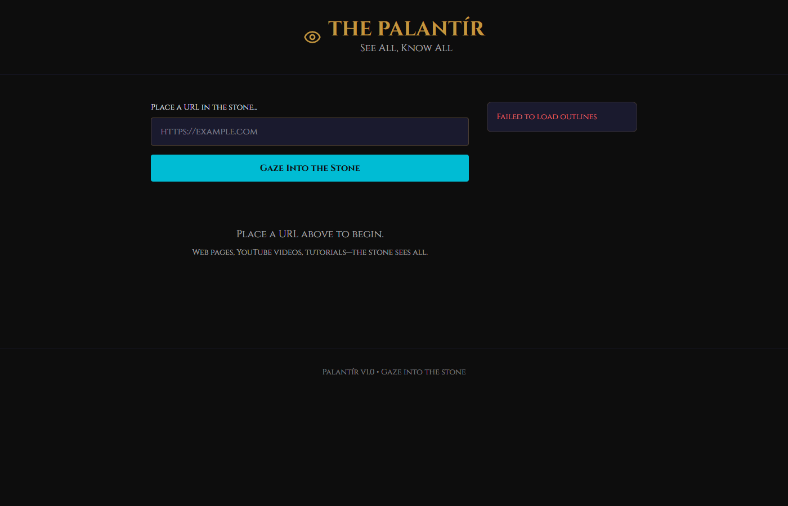

# Palantír — Content Scraper & Outline Generator

LotR-themed web and YouTube content scraper. Paste any URL → backend scrapes it → Claude API generates a structured outline → saved as `.md` and indexed in SQLite.

## Purpose

Fast conversion of any research URL (Kia tech videos, coding tutorials) into a referenceable structured outline — usable manually or forwarded to an AI assistant.

## Stack

| Layer | Tech |
|---|---|
| Backend | FastAPI + Python 3.11 |
| Frontend | Vite + React + TypeScript + Tailwind CSS |
| Database | SQLite + SQLAlchemy (WAL mode) |
| Web Scraping | Firecrawl Cloud API |
| YouTube | watch.py subprocess + asyncio.to_thread |
| LLM | Claude API (claude-sonnet-4-6) with prompt caching |
| Auth | Bearer token |

## Architecture

```
[Minas Tirith :3000] → [Palantir Frontend :5180]
                             ↓ (REST API)
                     [Palantir Backend :8008]
                         ↙ web  ↘ youtube
               Firecrawl Cloud   watch.py
                         ↘ ↙
                   Claude API → Structured Outline
                         ↓
                   SQLite + /outputs/*.md
```

## Quick Start

1. **Backend:**
   ```powershell
   cd backend
   python -m venv .venv
   .venv\Scripts\Activate.ps1
   pip install -r requirements.txt
   cp .env.example .env
   uvicorn main:app --host 127.0.0.1 --port 8008 --reload
   ```

2. **Frontend** (new terminal):
   ```powershell
   cd frontend
   npm install
   npm run dev
   ```

3. Open `http://localhost:5180`

## Environment

```
ANTHROPIC_API_KEY=sk-ant-...
PALANTIR_SECRET=your-secret-here
FIRECRAWL_API_KEY=fc-...
FIRECRAWL_API_URL=https://api.firecrawl.dev
WATCH_SCRIPTS_DIR=C:\path\to\.claude\skills\watch\scripts
```

## Ports

| Service | Port |
|---------|------|
| Backend | 8008 |
| Frontend | 5180 |

## Screenshot



## License

MIT
